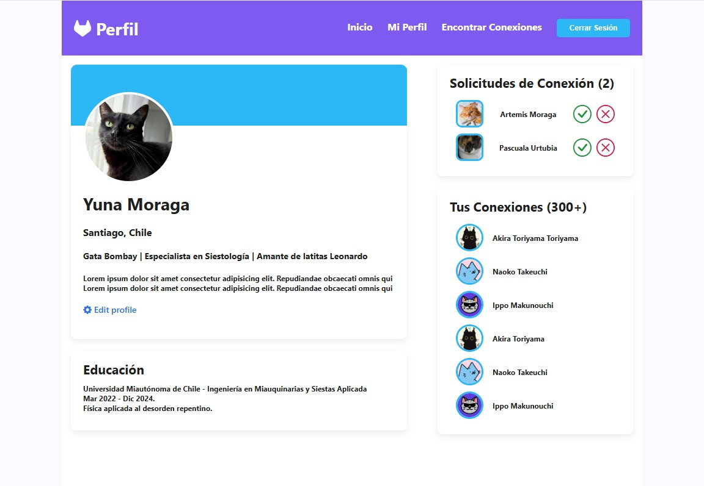
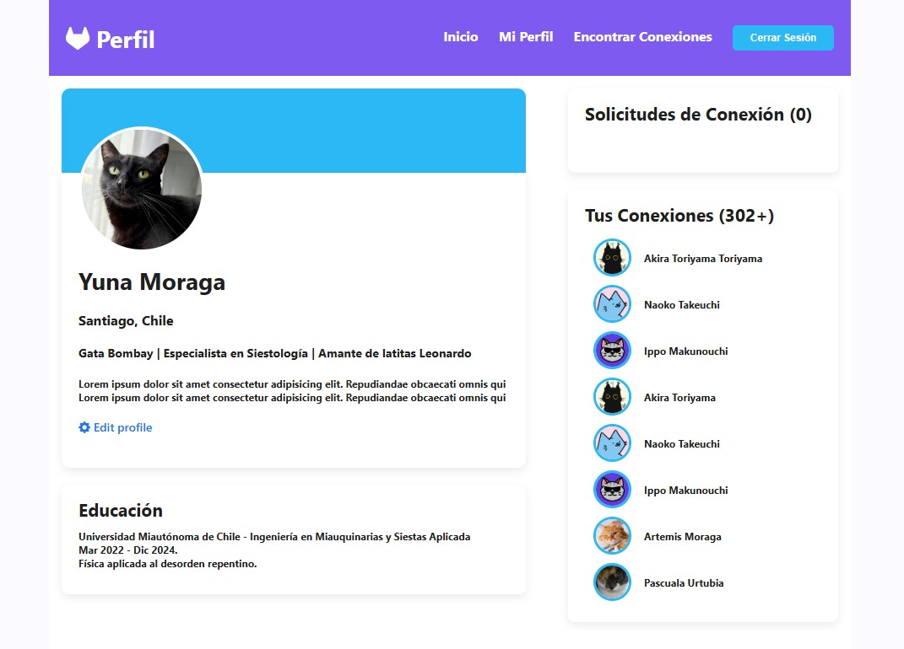
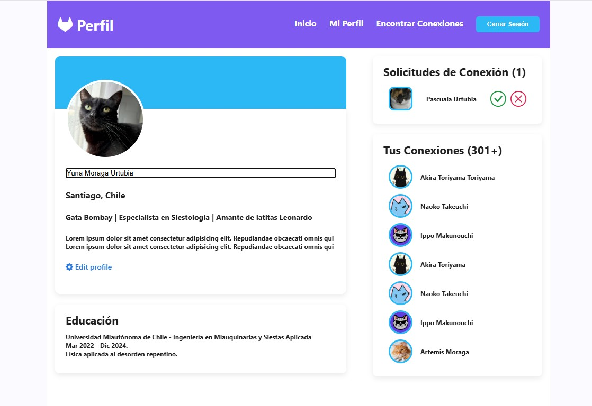
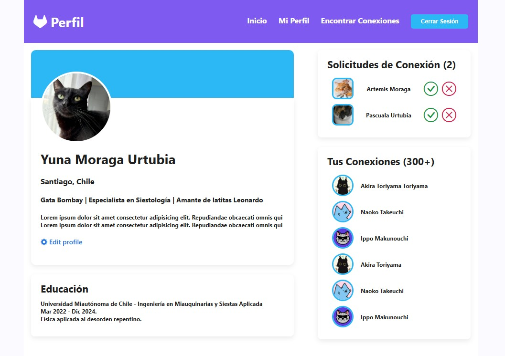

# Página de Perfil “Yuna” 🌸

## 🚀 Qué hace este proyecto

Esta es una página de perfil de escritorio pensada para practicar interacciones DOM. El objetivo principal es mostrar y administrar **solicitudes de conexión** y editar el nombre del perfil.

Funcionalidades principales:

* ✅ **Aceptar solicitud de conexión**: al aceptar, la solicitud **desaparece** del listado de pendientes y se **añade al listado de tus conexiones**.
* ✅ **Edit Profile**: el enlace o botón **"Edit Profile"** abre una **caja de texto** donde puedes cambiar el nombre del perfil; al confirmar, el nombre en la UI se actualiza.

---

## 🖼️ Capturas

### Perfil con solicitudes



### Después de aceptar: en la lista de conexiones



### Edit Profile — caja para cambiar el nombre





---

## 📁 Estructura sugerida del repositorio

```text
pagina-perfil-yuna/
├── index.html
├── styles.css
├── script.js       # lógica para aceptar solicitudes y editar nombre
└── screenshots/    # opcional, para las imágenes del README
```

---

## 🔧 Cómo funciona (resumen técnico)

* El listado de **solicitudes** está representado en el DOM (por ejemplo, una lista `<ul>` con `<li>`s o cards).
* Cada solicitud tiene un botón **Aceptar** que dispara un `click`.

  * Al aceptar: se elimina el elemento visual de la lista de pendientes y se agrega (programáticamente) un nuevo elemento en la sección **Tus conexiones**.
  * Puedes manejar esto con `Element.remove()` y `appendChild()` o con manipulación del `innerHTML` según prefieras.
* El botón **Edit Profile** muestra/oculta una caja de texto (`<input>`) y un botón para confirmar.

  * Al confirmar, se toma el valor del input y se actualiza el texto del elemento que muestra el nombre del perfil.

---


## 🐱‍👓 Autor

Proyecto por **Misaito**
