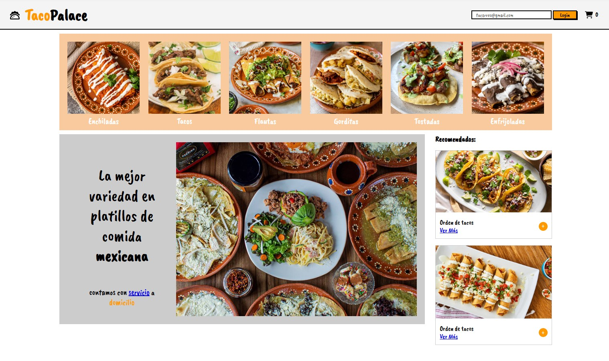

# 🌮 Taco Palace — Simulacro Bootcamp Skillnest

Bienvenido a **Taco Palace**, la página web definitiva para quienes veneran la comida mexicana.  
Aquí no solo comes… **te conviertes en parte de la tradición** 🇲🇽✨

Este proyecto muestra un sitio moderno donde puedes ver distintos platos mexicanos, sus ingredientes, fotos sabrosas y un diseño que te hace decir *“ay papá, esto sí es comida”*.

---

## 🌶️ Descripción del Proyecto

**Taco Palace** es una web creada para practicar y demostrar habilidades de **HTML, CSS y JavaScript**.

Incluye:

- 🌮 Catálogo de comida mexicana (tacos, burritos, quesadillas y más)
- 🔥 Animaciones suaves y modernas
- 🧅 Detalle de ingredientes con estilo
- 🛒 Botones de compra que aumentan el carrito (por ahora son de mentira… pero con estilo xD)

Perfecto para bootcampers, estudiantes o cualquier persona que quiera practicar frontend con algo sabroso.

## 🖼️ Capturas

---

## 📂 Tecnologías Usadas

- **HTML5**
- **CSS3**
- **JavaScript**
- **Google Fonts**

---
