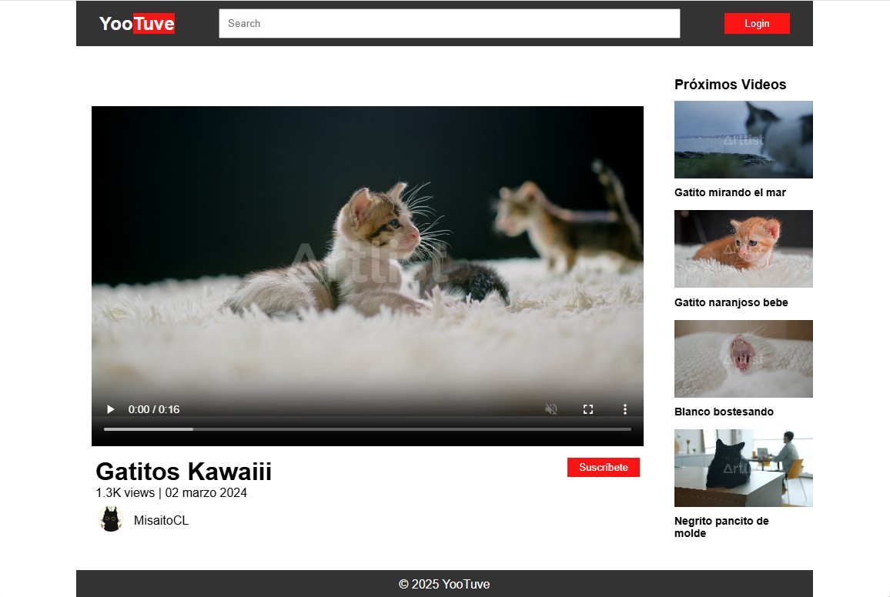
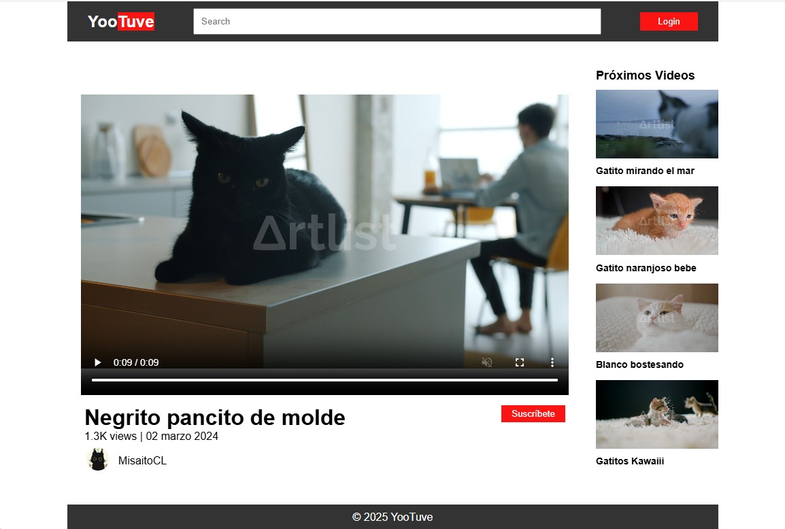

# Yootuve - Vista previa de video

¡Bienvenido a **YooTuve - Vista Previa de Video**! 🎥✨\
Un mini-proyecto frontend que replica la experiencia de YouTube al hacer
clic en un video lateral, cargándolo automáticamente en el reproductor
principal.

------------------------------------------------------------------------

## 🚀 Descripción del proyecto

Este proyecto muestra una interfaz tipo YouTube donde:

-   Se listan varios videos en una barra lateral.
-   Al hacer clic en cualquiera de ellos, el video principal cambia
    dinámicamente.
-   Todo se logra únicamente con **HTML, CSS y JavaScript**, sin
    frameworks.

Perfecto para practicar manipulación del DOM, eventos y organización de
componentes visuales.

------------------------------------------------------------------------

## 🖼️ Vista previa del proyecto

### Pantalla principal

### Vista previa al cambiar video

------------------------------------------------------------------------

## 🧠 ¿Cómo funciona?

### JS resumido (lógica principal)

-   Se seleccionan todos los videos de la barra lateral.
-   Cada uno tiene un evento `click`.
-   Al pinchar, se actualiza el video principal cambiando el `src` del
    iframe.

------------------------------------------------------------------------

## 🔧 Tecnologías utilizadas

-   **HTML5** - Estructura
-   **CSS3** - Estilos y layout
-   **JavaScript** - Lógica de cambio de video

------------------------------------------------------------------------

## 🐱‍👓 Autor

Proyecto creado por **Misaito** - amante del aerógrafo, el animé y los
gatos.\
Si te gustó, ¡dale una ⭐ en GitHub!
